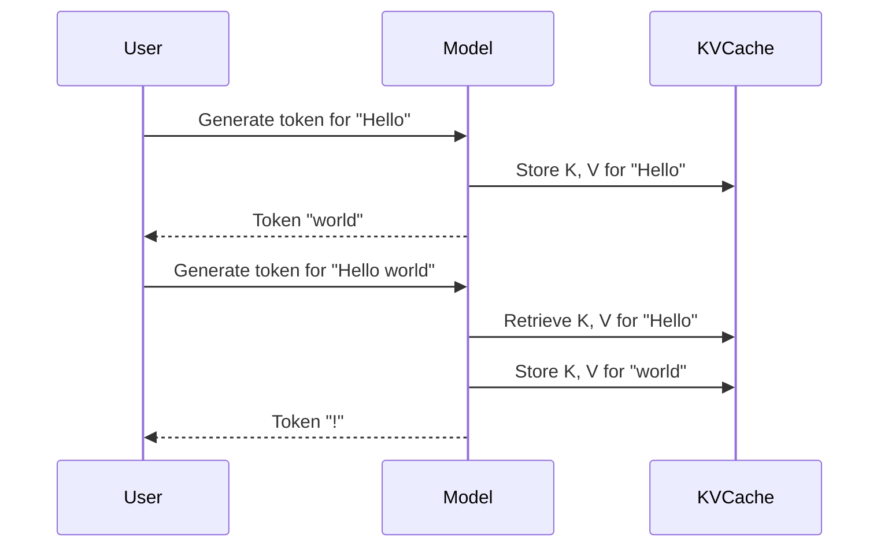

# Week 2 Day 1: Key-Value Cache

In the first week, we built a fully-functional Qwen2 model that can generate tokens based on a prompt. However, you may have noticed that the generation speed is slow. This is because for each new token we generate, we re-compute the attention for all previous tokens.

The key-value cache (KV cache) is a simple but effective optimization that addresses this problem. Instead of re-computing the key and value for all tokens at each step, we can cache them and reuse them for subsequent computations. This significantly speeds up the decoding process.



[📚 Reading: Key-Value (KV) Cache](https://huggingface.co/learn/llm-course/chapter4/3)

## Task 1: Implement `TinyKvFullCache`

In this task, you will implement `TinyKvFullCache`, a simple key-value cache that stores the full history of keys and values.

```
src/tiny_llm/kv_cache.py
```

The `TinyKvFullCache` has one method: `update_and_fetch`. This method takes the new key and value tensors, concatenates them with the cached keys and values, and returns the updated tensors. It also keeps track of the total number of tokens in the cache via the `offset` attribute.

```python
class TinyKvFullCache(TinyKvCache):
    def __init__(self):
        self.key_values = None
        self.offset = 0

    def update_and_fetch(
        self,
        key: mx.array,
        value: mx.array,
        mask_length: int | None = None,
        mask: mx.array | str | None = None,
    ) -> tuple[mx.array, mx.array, int, Optional[mx.array]]:
        if self.key_values is None:
            assert self.offset == 0
            self.key_values = (key, value)
            B, H, S, D = key.shape
            self.offset = S
            return key, value, 0, mask
        else:
            B, H, S, D = key.shape
            assert key.shape == value.shape
            prev_keys, prev_values = self.key_values
            assert prev_keys.shape == (B, H, self.offset, D)
            assert prev_values.shape == (B, H, self.offset, D)
            new_keys = mx.concat([prev_keys, key], axis=2)
            new_values = mx.concat([prev_values, value], axis=2)
            self.key_values = (new_keys, new_values)
            self.offset += S
            return new_keys, new_values, self.offset, mask
```

After implementing `TinyKvFullCache`, you can run the following tests to verify your implementation. We have included tests for shape mismatches and empty updates to ensure your implementation is robust.

```
pdm run test-refsol tests_refsol/test_week_2_day_1.py
```

{{#include copyright.md}}
