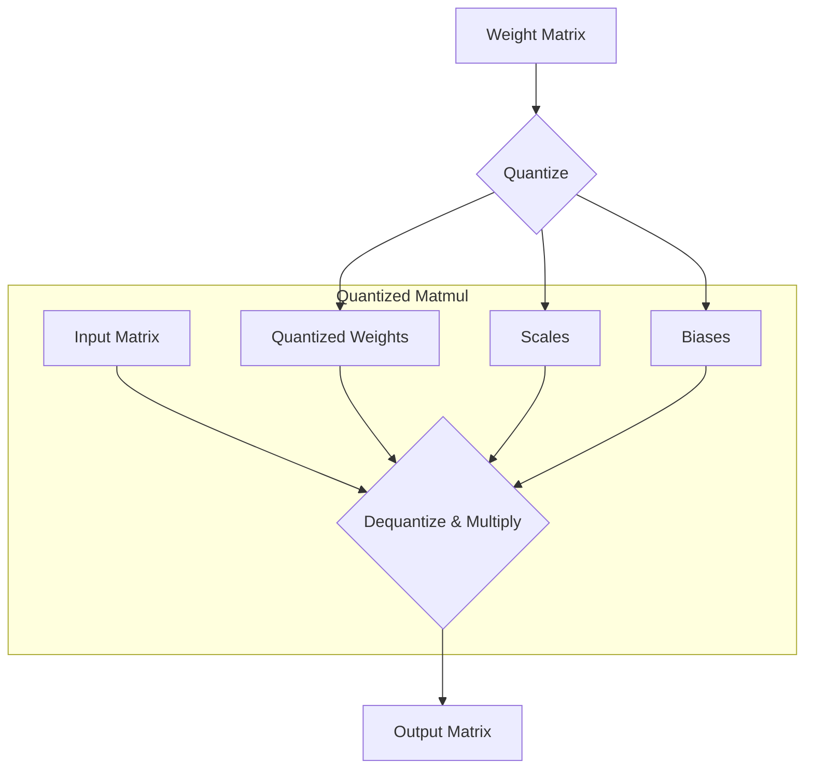

# Week 2 Day 2: Quantized Matmul and Linear - CPU

In this chapter, we will implement quantized matrix multiplication, which is a key optimization for LLM inference. Quantization reduces the precision of the model's weights, which in turn reduces the memory footprint and can lead to faster computation, especially on hardware with specialized support for lower-precision arithmetic.

We will focus on a CPU implementation of quantized matrix multiplication. While GPUs are the preferred hardware for training and serving large models, understanding the CPU implementation provides a solid foundation and is easier to debug and develop on.

[📚 Reading: What is quantization?](https://huggingface.co/docs/optimum/concept_guides/quantization)



## Task 1: Implement `quantized_matmul` on CPU

Your first task is to implement the `quantized_matmul` function in C++. This function will perform matrix multiplication where one of the matrices (the weights) is quantized.

```
src/extensions/src/quantized_matmul.cpp
```

The function will take the quantized weights, along with their scales and biases, and multiply them with the input matrix. The core of the implementation will be a nested loop that iterates over the dimensions of the matrices and performs the dequantization and multiplication for each element. The dequantization formula is `dequantized_value = quantized_value * scale + bias`.

You will need to implement the `quantized_matmul_impl` function, which contains the main logic for the CPU computation. The provided code already handles the Metal implementation for GPU, so you can focus on the CPU part.

After implementing the C++ function, you will need to build the extension by running:

```
pdm run build-ext
```

## Task 2: Implement `quantized_linear` in Python

Once the C++ extension is built, you will implement the `quantized_linear` function in Python. This function will be a wrapper around the C++ implementation.

```
src/tiny_llm/quantize.py
```

The `quantized_linear` function will take a `QuantizedWeights` object, which holds the quantized weights and their metadata, and an input tensor. It will call the C++ `quantized_matmul` function through the Python bindings and return the result.

You can run the following tests to verify your implementation:

```
pdm run test --week 2 --day 2
```

{{#include copyright.md}}
