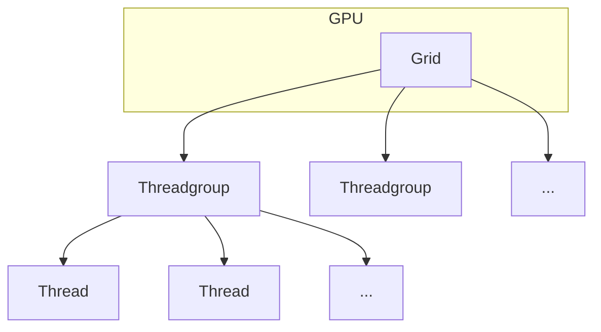

# Week 2 Day 3: Quantized Matmul and Linear - GPU

In the previous chapter, we implemented quantized matrix multiplication on the CPU. Now, we will accelerate this operation by leveraging the power of the GPU. We will be using Metal, Apple's graphics and compute API, to write a custom kernel for this task.

[📚 Reading: Introduction to Metal for Developers](https://developer.apple.com/metal/)



## Task: Implement the Metal Kernel

The first step is to write the Metal kernel that will perform the quantized matrix multiplication. We have expanded the Metal kernel to support 2, 4, and 8-bit quantization with group sizes of 32 and 64.

```
src/extensions/src/quantized_matmul.metal
```

The Metal kernel will be similar in logic to the C++ CPU implementation, but it will be executed in parallel by many threads on the GPU. Each thread will be responsible for calculating a single element in the output matrix. The kernel will receive the quantized weights, scales, biases, and the input matrix as buffers. The `[[kernel]]` qualifier indicates that this is a Metal kernel function, and the `device` address space qualifier indicates that the buffers are stored in device memory.

Your task is to implement the `quantized_matmul_w4a16_g64` kernel. This kernel will dequantize the weights and perform the multiplication and accumulation in a loop.

## Task 2: Implement the GPU Evaluation Function

After writing the Metal kernel, you need to implement the C++ function that will launch this kernel.

```
src/extensions/src/quantized_matmul.cpp
```

You will need to implement the `QuantizedMatmul::eval_gpu` function. This function will:
1. Get the Metal device and command encoder.
2. Get the compiled Metal kernel from the library. The kernel is compiled from the `.metal` file when you build the extension.
3. Set the input and output buffers for the kernel. This involves passing the `mx::array` objects to the command encoder.
4. Define the grid and threadgroup sizes. The grid size determines the total number of threads, and the threadgroup size determines how the threads are grouped together.
5. Dispatch the kernel for execution. This will launch the kernel on the GPU.

After implementing the C++ and Metal code, you need to rebuild the extension:

```
pdm run build-ext
```

You can run the following tests to verify your implementation. We have included tests for various matrix dimensions, group sizes, and bit depths.

```
pdm run test-refsol tests_refsol/test_week_2_day_3.py
```

{{#include copyright.md}}
